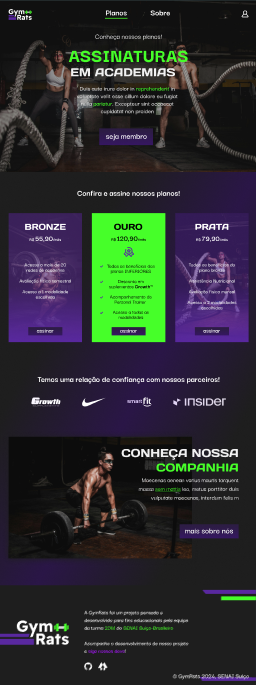
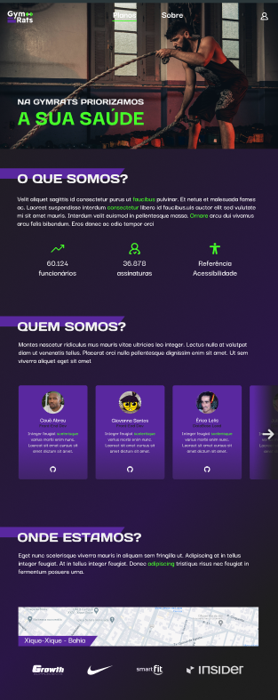
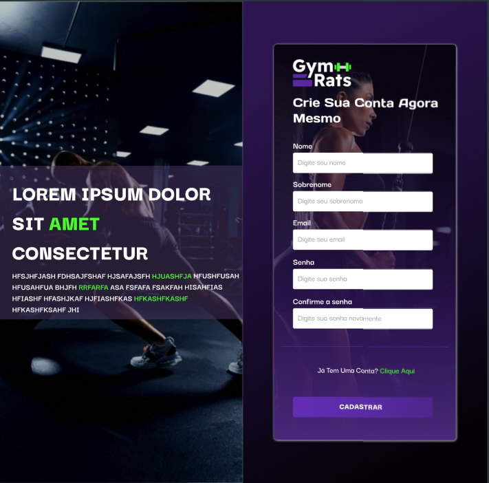
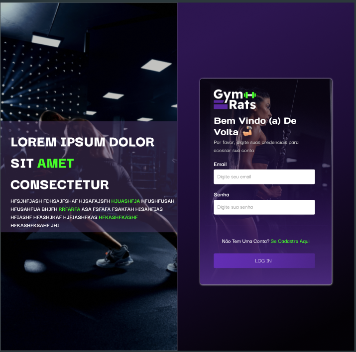
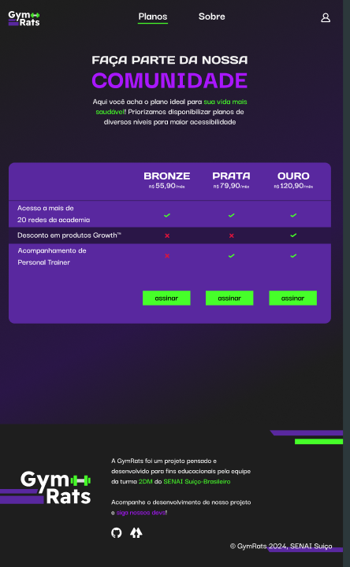
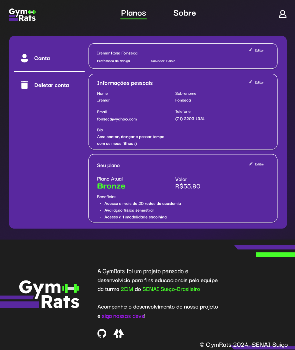
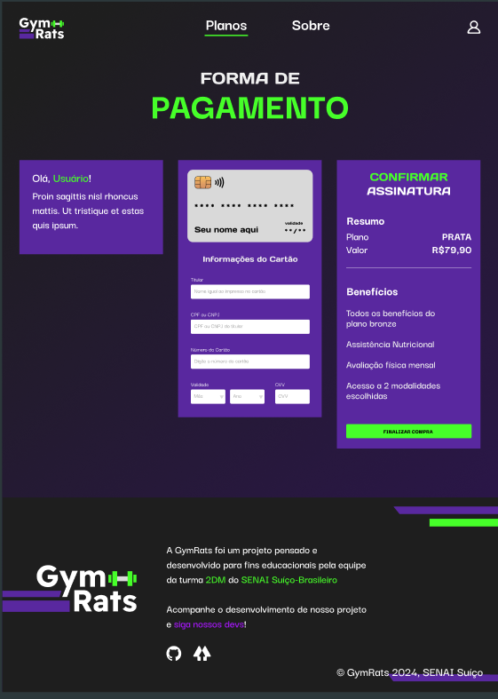

<h1> Projeto integrador 2DM - GymRats </h1>

<h2> Tecnologias utilizadas </h2>

<strong> ReactJs </strong>

<strong> Figma </strong>

<h1>Utilização</h1>

<ol>

  <li>Clone esse repositório: <code>git clone https://github.com/leoguims/Integrador2DM.git</code></li> 

  <li>Navegue até o diretório gerado: <code>cd Integrador2DM</code></li> 

  <li>Instale as dependências do React: <code>npm install</code></li> 

  <li>Inicie o servidor: <code>npm run dev</code></li>

</ol>

<h2>Funcionalidades</h2>

 Nosso projeto oferece acesso a varias redes de academia. Nela temos opções de serviços personalizados, desde diversas modalidades, acesso a profissionais qualificados e muito mais. 

<h2> Pré-visualização das páginas </h2>
 
<h3>Pagina Home</h3>

 </img>      

<h3>Pagina Sobre</h3>

 </img>      

<h3>Pagina Cadastro</h3>

 </img>      

<h3>Pagina Login</h3>

 </img>      

<h3>Pagina Planos</h3>

 </img>      

<h3>Pagina Perfil</h3>

 </img>      Pagina Pagamento</h3>

 </img>      